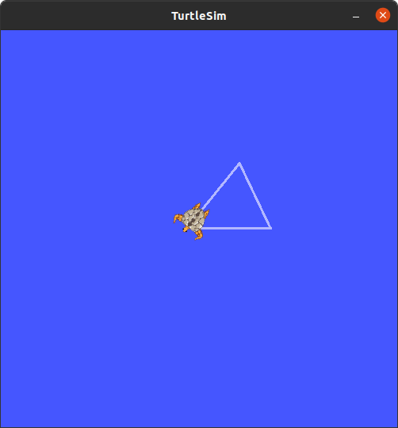
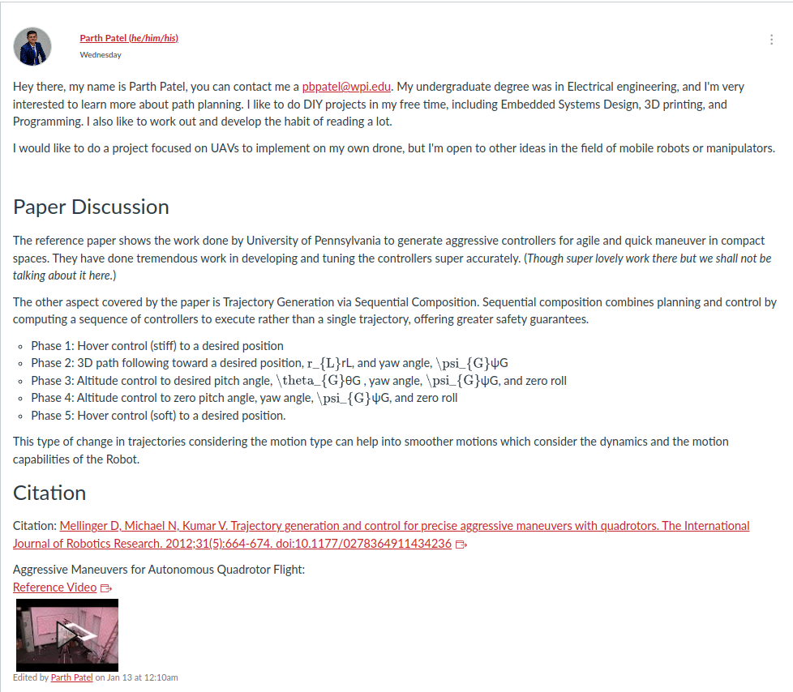

**Assignment 0**

<!-- TOC -->

- [Introduction](#introduction)
- [Turtle Graphics](#turtle-graphics)
    - [Requirements](#requirements)
    - [Code](#code)
        - [How to Run the code](#how-to-run-the-code)
        - [Code Basics](#code-basics)
        - [Results](#results)
- [ROS Installation](#ros-installation)
    - [ROS Demonstration with TurtleSim](#ros-demonstration-with-turtlesim)
- [Create an Obstacle Field](#create-an-obstacle-field)
        - [How to Run the code](#how-to-run-the-code)
        - [Code Basics](#code-basics)
        - [Results](#results)
- [Motion Planning Introduction](#motion-planning-introduction)
    - [Essay](#essay)
    - [Citation](#citation)
    - [Submission](#submission)

<!-- /TOC -->

# Introduction
The aim of the assignment is to setup the environment (guide to [setup](../Docs/)) and try out hands on the environment to practise and test the setup.

# Turtle Graphics

## Requirements
To encourage the setup of a working Python environment, create a pattern using turtle graphics. Python has a built-in turtle graphics module. To make things more interesting, our dim witted turtle has lost his friend, and needs to execute a *Victor Sierra* search pattern, shown below


## Code

### How to Run the code

Open a new terminal and cd into `HW0 - Turtles/Turtle Graphics` directory. Run the Python file using:
```shell
python3 turtle_graphics.py
```

### Code Basics

```python
def main():
    search_spread = 50  # Radius of search
    active_search = False  # Whether it is an active search or simple pattern build
```

- `search_spread` variable is used to set the search area radius for the Vierra Pattern to build. This distance is in *pixels*.
- `active_search` is a boolean which determines whether to actively look for the lost turtle or just create a Search Pattern for visual display.

```python
def perform_search(rescuer_turtle, lost_turtle, search_radius, active_search):
```

Move the turtle in Vierra Search Pattern. If the rescuer is in:
- active rescue state: it move 4 unit in forward direction and looks for the lost turtle.
    - If it fails to find it, it continues.
    - If it finds the lost turtle, it returns the current location of rescuer turtle and the error of position
- Not Rescue State: Creates Infinite Vierra Search Pattern

Args:
- `rescuer_turtle (turtle.Turtle())`: The Turtle Object Looking for the Lost Turtle
- `lost_turtle (turtle.Turtle())`: The Turtle Object that is lost
- `search_radius (int)`: Search Area Radius in px
- `active_search (bool)`: True -> Active Search, False -> Pattern Building

```python
def victor_sierra_search(rescuer_turtle, lost_turtle, search_radius, active_search):
```

Initiate a Victor Sierra Search Pattern.

Args:
- `rescuer_turtle (turtle.Turtle())`: The Turtle Object Looking for the Lost Turtle
- `lost_turtle (turtle.Turtle())`: The Turtle Object that is lost
- `search_radius (int)`: Search Area Radius in px
- `active_search (bool)`: True -> Active Search, False -> Pattern Building

```python
def place_lost_turtle(lost_turtle, lost_radius, active_search):
```

Randomly select the position to set the location of lost turtle. Turtle is hidden if it is not active search

Args:
- `lost_turtle (turtle.Turtle())`: The Turtle Object that is lost
- `search_radius (int)`: Search Area Radius in px
- `active_search (bool)`: True -> Active Search, False -> Pattern Building

### Results

**Active Search:**\
Click the Video below to see the simulation:\
<a href="https://youtube.com/shorts/naEB1eCU-QM">
    
</a>

**Inactive Search:**\
Click the Video below to see the simulation:\
<a href="https://youtube.com/shorts/1GMheKd6lk0?feature=share">
    
</a>

# ROS Installation

We need to install [ROS Noetic](https://wiki.ros.org/noetic). The complete installation guide can be found [here](/Docs/README.md).

## ROS Demonstration with TurtleSim

Open a new terminal and initialize roscore using:

```shell
roscore
```

Open a new terminal and run the following code to initate the turtlesim:

```shell
rosrun turtlesim turtlesim_node
```

Initiate the script to read the keyboard keys to control the turtle using:

```shell
rosrun turtlesim turtle_teleop_key
```

Use your arrow keys to move the robot around.



Get the list of all active topics in a new terminal using the command

```shell
rostopic list
```

Echo the `turtle1/pose1` topic using:

```shell
rostopic echo /turtle1/pose
```

The Terminal will update with the latest position and velocity values.


# Create an Obstacle Field
Subsequent assignments will rely on planning within two dimensional *grid world* type environments. Using any tools or programming languages, create a random obstacle field in a 128×128 grid, using tetrominoes as depicted in Figure.


Create a function, $f(\rho)$, to randomly distribute obstacles with varying coverage $\rho \in[0,1]$. For example, a coverage rate of 10% would place approximately 400 obstacles in the field, occupying maybe 1600 cells out of 16384 total. Demonstrate your obstacle field implementation by submitting full source code, and three figures depicting 10%, 50%, and 70% obstacle coverage.


### How to Run the code

Open a new terminal and cd into `HW0 - Turtles/Obstacle Field` directory. Run the file using:
```shell
make
```

Wait for the compilation to finish. The window will prompt out your input for the coverage percentage required `Enter The Area Coverage Percentage:`

### Code Basics

In order to improve the speed of the code, a small trick has been applied. We have roughly calculated the required blocks that are needed to be placed.

This is a sample calculation show below:

$$
\begin{equation}
h = 128\notag
\end{equation}
$$

$$
\begin{equation}
w = 128\notag
\end{equation}
$$

$$
\begin{equation}
h*w = 16384\notag
\end{equation}
$$

$$
\begin{equation}
\eta = 10\%\notag
\end{equation}
$$

where $\eta$ is the coverage percentage.

$$
\begin{equation}
n = 1638\notag
\end{equation}
$$

where $n$ is the number of pixels to be covered.

$$
\begin{equation}
n_{blocks} = \frac{1638}{4} = 409\notag
\end{equation}
$$

We randomly place $409$ block and do not tally or count the grid total as considering overall of blocks and placement, the total coverage still shall remain under 1638 pixels. After the minimum number of pixels are placed, we check the grid total and thus, calculate the total of the grid and then place new blocks after constantly checking the total. This way, for the first 409 turns, we don't check the total sum and are able to reduce this step and save some time.

```cpp
#include <SFML/Graphics.hpp>
```

Header File to include SFML Library after installation.

```cpp
#define GRID_WIDTH 128
#define GRID_HEIGHT 128
std::uint8_t grid_array[GRID_WIDTH][GRID_HEIGHT]; // Grid to store info
```

To set the `GRID_WIDTH` and `GRID_HEIGHT` in px length. This determines the size of bounding box.\
`grid_array` stores the bit information of where the particular position on the grid holds a block or not.

```cpp
void setup_grid(sf::RenderWindow *window)
```
Set the up the Graphical Window to display the Matrix by building the horizontal and vertical lines to define the matrix box. Also Set the Frame Rate to 30fps.

Takes the pointer to `window` as input.

```cpp
std::array<uint8_t, 2> get_block_placement_position()
```
Generate a random position and return a (x,y) coordinate array.

```cpp
uint8_t get_block_type()
```
Select a random block type out of the four available option.


Return number according to Block Type:
- `0` -> Line
- `1` -> Inverted L
- `2` -> S
- `3` -> T

```cpp
void update_grid_window(uint8_t block_type, std::array<uint8_t, 2> location, sf::RenderWindow *window)
```

Set the block on grid window. Takes block type, location and window as input.

```cpp
void update_grid_array(uint8_t block_type, std::array<uint8_t, 2> position)
```

Set the bit on the grid array. Takes block type, location and window as input.

```cpp
std::uint64_t calculate_coverage()
```
Sum the whole matrix looking for the '1' bit and totaling it. Returns the summation of the covered pixels on the grid array.

```cpp
void plot_object(sf::RenderWindow *window)
```

Function to execute sequence of statements to place the block on the window.

### Results

- **10% Coverage**:
    

- **50% Coverage**:
    

- **70% Coverage**:
    

# Motion Planning Introduction
Find an interesting application of motion planning, and create a short report. Format may be written, slide presentation, video, or other. Cite references, and give clear examples. What do you find interesting about this method? What kind of problem does it solve? What familiar applications is it used in?

Be brief, consider this an elevator pitch to the rest of the class. Post your application summary, along with a short introduction about yourself, to the course discussion board.

## Essay

The reference paper shows the work done by University of Pennsylvania to generate aggressive controllers for agile and quick maneuver in compact spaces. They have done tremendous work in developing and tuning the controllers super accurately. (*Though super lovely work there but we shall not be talking about it here.*)

The other aspect covered by the paper is Trajectory Generation via Sequential Composition. Sequential composition combines planning and control by computing a sequence of controllers to execute rather than a single trajectory, offering greater safety guarantees.

- Phase 1: Hover control (stiff) to a desired position
- Phase 2: 3D path following toward a desired position, $r_{L}$, and yaw angle, $\psi_{G}$
- Phase 3: Altitude control to desired pitch angle, $\theta_{G}$ , yaw angle, $\psi_{G}$, and zero roll
- Phase 4: Altitude control to zero pitch angle, yaw angle, $\psi_{G}$, and zero roll
- Phase 5: Hover control (soft) to a desired position.

This type of change in trajectories considering the motion type can help into smoother motions which consider the dynamics and the motion capabilities of the Robot.

## Citation

Citation: [Mellinger D, Michael N, Kumar V. Trajectory generation and control for precise aggressive maneuvers with quadrotors. The International Journal of Robotics Research. 2012;31(5):664-674. doi:10.1177/0278364911434236](https://journals.sagepub.com/doi/abs/10.1177/0278364911434236)

Aggressive Maneuvers for Autonomous Quadrotor Flight: [Reference Video](https://youtu.be/MvRTALJp8DM)

## Submission



# Design Details

- Designed for:
  - Worcester Polytechnic Institute
  - RBE 550-S23-S01: Motion Planning
- Designed by:
  - [Parth Patel](mailto:parth.pmech@gmail.com)

# License

This project is licensed under [GNU General Public License v3.0](https://www.gnu.org/licenses/gpl-3.0.en.html) (see [LICENSE.md](LICENSE.md)).

Copyright 2023 Parth Patel

Licensed under the GNU General Public License, Version 3.0 (the "License"); you may not use this file except in compliance with the License.

You may obtain a copy of the License at

_https://www.gnu.org/licenses/gpl-3.0.en.html_

Unless required by applicable law or agreed to in writing, software distributed under the License is distributed on an "AS IS" BASIS, WITHOUT WARRANTIES OR CONDITIONS OF ANY KIND, either express or implied. See the License for the specific language governing permissions and limitations under the License.